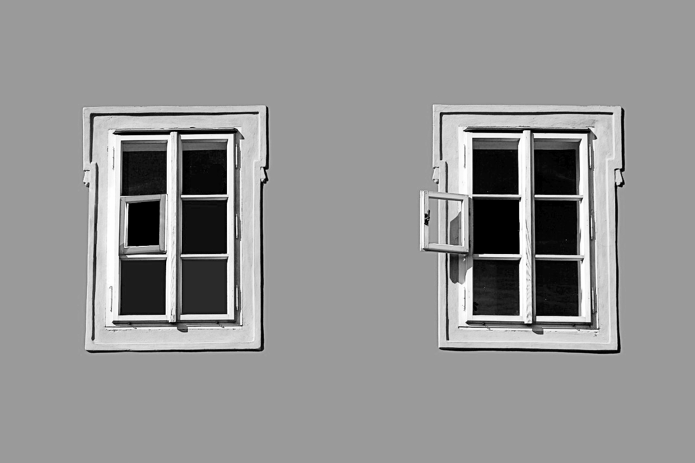

<small>Credits: Moshehar Pixabay</small>

 

शाम में पार्क में चहल पहल रहती थी, कोई नयी बात नहीं थी।  

"दादा जी नमस्ते, नमस्ते दादी जी", कहते कोई जॉगिंग करता हुआ गुज़ारा। दादा जी थोड़ी ऊँची आवाज़ में बोले, "खूब खुश रहो"। दोनों टहल रहे थे, सोसाइटी के बीच में बड़ा पार्क था, पार्किंग थीं, इमारतें थीं, बच्चे खेलते थे, झूले थे, बेंच लगे थे, पेड़-पौधे थे, कई लोग थे। 

दादीजी के सफ़ेद बालों से उनकी उम्र का अंदाजा लगाया जा सकता थ। दादाजी की झुर्रियों भी। 

"तुम्हे अजीब नहीं लगता, लोग हमें दादा-दादी बुलाते है?", दादीजी ने पूछा। 

"फिर क्या कहेंगे?"

दादी दादाजी की और देख रहीं थी, आखों में चमक थी, और प्यारी सी मुस्कान थी। 

"तुम सब समझते हो, बस भोले बनते हो"

दादीजी के हाथ में एक थैली रोज़ होती थी, उसमे एक टिफ़िन का डब्बा होता था, उनके हाथ में एक गुलाब का फूल भी रोज़ होता था। पर आज कुछ चीज़ें नयी थीं, रोज़ की तरह आज दादाजी के बाल सफ़ेद नहीं थे, सुबह उनमे कुछ रसायन किया गया होगा।  आज उनके हाथ में एक डायरी थी, ये भी नयी बात थी।  डायरी वैसे तो पतली थी, पर कई लिफाफों और कागज़ों को उसके पन्नो के बीच फंसा दिए जाने के कारण, कोई मोटी किताब मालूम हो रही थी। 

रोज़ दोनों चेहरों पर एक मुस्कान होती थी, आज दादाजी की मुस्कान ज़्यादा बड़ी थी। 

दोनों एक बेंच पर बैठ गए, टिफ़िन और डायरी भी बेंच पर साथ बैठे।  ढक्कन खुला, हलवे की खुशबू आयी, खायी गयी, तारीफें की गयी, डब्बा बंद हुआ, फिर साथ बैठ गया। 

"आज मैंने कमरे की सफाई की", दादाजी ने शुरू किया। 

"स्कूल के समय का मेरा बक्सा निकला।  हर साल निकलता है, मेरी उसमे कोई ख़ास दिलचस्पी नहीं थी, फिर भी मैंने उसे खोला, चलो काम-से-काम सफाई की हो जायेगी"

दादीजी सुन रही थीं, कभी फूल को देखतीं, कभी खेलते बच्चों को, कभी डायरी-नरेश को। 

“मेरी राइटिंग बहुत सुंदर हुआ करती थी। मेरे दोस्त, कभी उनके दोस्त, कहीं से दो-चार लाइनें ले आया करते थे, मेरा काम कार्ड और लेटर लिखने का होता था…”

“मैं शांत किस्म का था।”

“आज भी हो”, दादीजी मुस्कुराईं। 

ये शांत स्वभाव सिर्फ दादा जी का नहीं था।

“मेरी तो कभी बात बनी नहीं, और अब लिखने बैठूं तो अपना नाम भी साफ न लिख पाऊं। इस डायरी मैं उन्हीं लाइनें लिखा करता था, कभी एक स्टाइल में कभी दूसरे।" 

"लो इसे तुम रख लो”

“ये कैसा बचपना है!”, दादीजी ने कहा, हँसते हुए डायरी छीन ली। बचपना भी सिर्फ दादाजी का नहीं था।

> ऐसे हँस हँस के न देखा करो सब की जानिब, लोग ऐसी ही अदाओं पे फिदा होते हैं

दादी जी ने पढ़ा, एक हाथ कुछ ऊपर उठाया और कहा “वाह!" एक पन्ने पर शेर और नीचे मजरूह सुल्तानपुरी का नाम लिखा था। सुंदर साफ अक्षर थे, उसी पन्ने में चार और तरह से ये लाइनें लिखी हुई थी। सारी सुंदर।

रोज़ की तरह बातें हुई, पर रोज़ की तरह हाल चाल नहीं पूछे गए, आज तबियत की बातें नहीं की गयी, आज कहानियां सुनायी गई, ये भी नयी बात थी।

दोनों घरों के बीच पार्क था, बच्चे खेलते थे, ये पुरानी बात थी।

दादीजी छत से दादाजी को गार्डनिंग करते देखना, पुरानी बात थी।

दादाजी का फूलों में पानी देते हुए दादी जी को निहारना भी पुरानी बात थी।

> उसने जब मुझसे किया, अहदे वफा आहिस्ता, दिल के वीराने में इक फूल खिला, आहिस्ता

डॉ. शफी हसन की लाइनें लिखी दो बार गयी थी, पढ़ी कई बार गयी।
